layout: true
<div class="slide-footer" style="position: absolute;left:20px;bottom:5px;font-size: 12px;">Hussain Hadah (Murphy Institute/Tulane) | Immigration Enforcement and Hispanic Identity  | NBER `r format(Sys.time(), '%B %d %Y')`</div>

<!--- `r rmarkdown::metadata$subtitle` | `r format(Sys.time(), '%d %B %Y')`-->

---

```{r, load_refs, echo=FALSE, cache=FALSE, message=FALSE}
library(RefManageR)
BibOptions(check.entries = FALSE, 
           bib.style = "authoryear", 
           cite.style = 'authoryear', 
           style = "markdown",
           hyperlink = FALSE, 
           dashed = FALSE)
myBib <- ReadBib("assets/example.bib", check = FALSE)
top_icon = function(x) {
  icons::icon_style(
    icons::fontawesome(x),
    position = "fixed", top = 10, right = 10
  )
}
```

```{r setup, include=FALSE}
# xaringanExtra::use_scribble() ## Draw on slides. Requires dev version of xaringanExtra.

options(htmltools.dir.version = FALSE)
library(knitr)
opts_chunk$set(
  fig.align="center",  
  fig.height=4, fig.width=6,
  out.width="748px", out.length="520.75px",
  dpi=300, #fig.path='Figs/',
  cache=F#, echo=F, warning=F, message=F
  )
```


```{r, cache=FALSE, message=FALSE, warning=FALSE, include=TRUE, eval=TRUE, results=FALSE, echo=FALSE, tidy.opts = list(width.cutoff = 50), tidy = TRUE}
## Load and install the packages that we'll be using today
if (!require("pacman")) install.packages("pacman")
pacman::p_load(tictoc, parallel, pbapply, future, future.apply, 
furrr, RhpcBLASctl, memoise, here, foreign, mfx, tidyverse, 
hrbrthemes, estimatr, ivreg, fixest, sandwich, lmtest, margins, 
vtable, broom, modelsummary, stargazer, fastDummies, recipes, 
dummy, gplots, haven, huxtable, kableExtra, gmodels, survey, 
gtsummary, data.table, tidyfast, dtplyr, microbenchmark, ggpubr, 
tibble, viridis, wesanderson, censReg, rstatix, srvyr, formatR, 
sysfonts, showtextdb, showtext, thematic, sampleSelection, 
RefManageR, DT, googleVis, png, renderthis)
# devtools::install_github("thomasp85/patchwork")
remotes::install_github("mitchelloharawild/icons")
remotes::install_github("ROpenSci/bibtex")

# devtools::install_github("ajdamico/lodown")
## My preferred ggplot2 plotting theme (optional)
## https://github.com/hrbrmstr/hrbrthemes
# scale_fill_ipsum()
# scale_color_ipsum()
font_add_google("Fira Sans", "firasans")
font_add_google("Fira Code", "firasans")

showtext_auto()

theme_customs <- theme(
  text = element_text(family = 'firasans', size = 16),
  plot.title.position = 'plot',
  plot.title = element_text(
    face = 'bold', 
    colour = thematic::okabe_ito(8)[6],
    margin = margin(t = 2, r = 0, b = 7, l = 0, unit = "mm")
  ),
)

colors <-  thematic::okabe_ito(5)

# theme_set(theme_minimal() + theme_customs)
theme_set(hrbrthemes::theme_ipsum() + theme_customs)
## Set master directory where all sub-directories are located
mdir <- "/Users/hhadah/Dropbox/Research/My Research Data and Ideas/Identification_Paper"

## Set working directories
## Set working directory
mdir <- "~/Library/CloudStorage/Box-Box/education-audit-study"
rawdatadir  <- paste0(mdir,"/data/raw")
datasets  <- paste0(mdir,"/data/datasets")

## Set working directory

# COLOR PALLETES
library(paletteer) 
# paletteer_d("awtools::a_palette")
# paletteer_d("suffrager::CarolMan")

### COLOR BLIND PALLETES
#paletteer_d("colorblindr::OkabeIto")
#paletteer_d("colorblindr::OkabeIto_black")
# paletteer_d("colorBlindness::paletteMartin")
# paletteer_d("colorBlindness::Blue2DarkRed18Steps")
# paletteer_d("colorBlindness::SteppedSequential5Steps")
# paletteer_d("colorBlindness::PairedColor12Steps")
# paletteer_d("colorBlindness::ModifiedSpectralScheme11Steps")
colorBlindness <- paletteer_d("colorBlindness::Blue2Orange12Steps")
cbbPalette <- c("#000000", "#E69F00", "#56B4E9", "#009E73", "#F0E442", "#0072B2", "#D55E00", "#CC79A7")

# scale_colour_paletteer_d("colorBlindness::ModifiedSpectralScheme11Steps", dynamic = FALSE)
# To use for fills, add
  scale_fill_manual(values="colorBlindness::Blue2Orange12Steps")

# To use for line and point colors, add
  scale_colour_manual(values="colorBlindness::Blue2Orange12Steps")
  #<a><button>[Click me](#sources)</button></a>
```

```{css, echo=F}
    /* Table width = 100% max-width */

    .remark-slide table{
        width: auto !important; /* Adjusts table width */
    }

    /* Change the background color to white for shaded rows (even rows) */

    .remark-slide thead, .remark-slide tr:nth-child(2n) {
        background-color: white;
    }
    .remark-slide thead, .remark-slide tr:nth-child(n) {
        background-color: white;
    }
```
```{r xaringan-fit-screen, echo=FALSE}
xaringanExtra::use_fit_screen()
```

```{r xaringanExtra, echo = FALSE, eval = FALSE}
xaringanExtra::use_progress_bar(color = "#0051BA", location = "top")
```

## The Hispanic and Latino populations are the largest minority groups in the U.S.

<br>

- ### The 2020 Census counted 62 million Hispanics (19&#37; of the population)


- ### Nearly all studies of Hispanic outcomes rely on .brand-crawfest[self-reported Hispanic identity]

  - .font100[This implicitly treats Hispanic identity as a fixed/exogenous characteristic of individuals with a Hispanic origin]

--
- ### .brand-crawfest[**But what if endogenous self-reported Hispanic identity is influenced by external factors?**]

---
## Who's Hispanic? The Hispanic origin question in  the CPS

<br>

- .font120[Since 2003, CPS asks: "Are you Spanish, Hispanic, or Latino?"]
  - If YES, a person is coded into major groups: "Hispanic or Latino" and "Not Hispanic or Latino."

<br>

- .font120[Previous studies argue that these questions reflect "self-identification" (i.e., subjective and endogenous measure)]

<br>

- .font120["Objective" indicators of Hispanic descent have been proposed .font50[.gray[**(e.g., Duncan and Trejo (2007; 2009; 2011), and Antman, Duncan, and Trejo (2020b))**]]]
  - .font80[Based on birthplace of the individual, their parents, and grandparents]

---
name: endogenous-attrition-plot

## Endogenous Hispanic and ethnic attrition is a well-documented phenomenon

.pull-left-narrow[

US-born descendants of Hispanic immigrants tend to self-identify as non-Hispanic .font50[.gray[**(Duncan and Trejo
2007, 2011, 2017; Antman, Duncan, and Trejo 2020b)**]] .tiny[[[Objective vs. subjective Hispanic identity]](#app-objective-vs-subjective)[[Data and sample]](#data-sample)]
]

.pull-right-wide[
```{r plot1, echo=FALSE, warning=FALSE, out.width="80%", fig.show='hold', fig.align='right'}
# Read the image file
plot1 <- readPNG("more_slides_material/plot-hispan-identity-by-gen.png")

# Plot the image
grid.raster(plot1)
```
]

---
## What causes Hispanic attrition?

- Correlates of ethnic attrition are well documented:
  - .font80[.brand-crawfest[**Intermarriage**]: primary driver; children of interethnic marriages are far more likely to attrit .font50[.gray[**(Duncan and Trejo 2011)**]]]
  - .font80[.brand-crawfest[**Socioeconomic status**]: attritors are more educated, higher income .font50[.gray[**(Duncan]
and Trejo 2011, 2017)**]]
  - .font80[.brand-crawfest[**Local prejudice**]: State-level anti-Hispanic bias reduces Hispanic identity .font50[.gray[**(Hadah 2024)**]]]

- If Hispanic attritors are positively selected,
  - .font80[Conventional estimates overstate Hispanic health disparities .font50[.gray[**(Antman, Duncan, and Trejo (2016; 2020b))**]]]
  - .font80[Standard measures understate intergenerational educational progress and assimilation .font50[.gray[**(Duncanand Trejo 2011, 2017)**]]]
  - .font80[Ethnic gaps in labor market overstate the extent of discrimination in the most biased states .font50[.gray[**(Hadah 2024)**]]]

- .brand-crawfest[**Open question: Can policies that disproportionately affect Hispanics causally change ethnic self-identification?**]

---
name: motivation

## What we study in this paper

<br>

- Policy context: .brand-crawfest[**Secure Communities (SC)**]
  - Automated fingerprint sharing between local police and federal immigration authorities .tiny[[[Secure Communities background]](#app-sc-background) [[How SC works]](#app-sc-work)]
<br>

- Growing literature documents *spillover effects* on Hispanic community
  - Safety net participation, poverty, engagement with institutions, suicide .font50[.gray[**(Watson 2014; Amuedo-Dorantes, Arenas-Arroyo, and Sevilla 2018; Dee and Murphy 2020; Alsan and Yang 2024; Hadah 2025)**]]

<br>

- .brand-crawfest[**Does immigration enforcement (Secure Communities) change who identifies/self-reports as Hispanic?**]

---
name: sc-rollout

## Cumulative share of counties activating Secure Communities, and monthly removals, 2008--2013

.center[
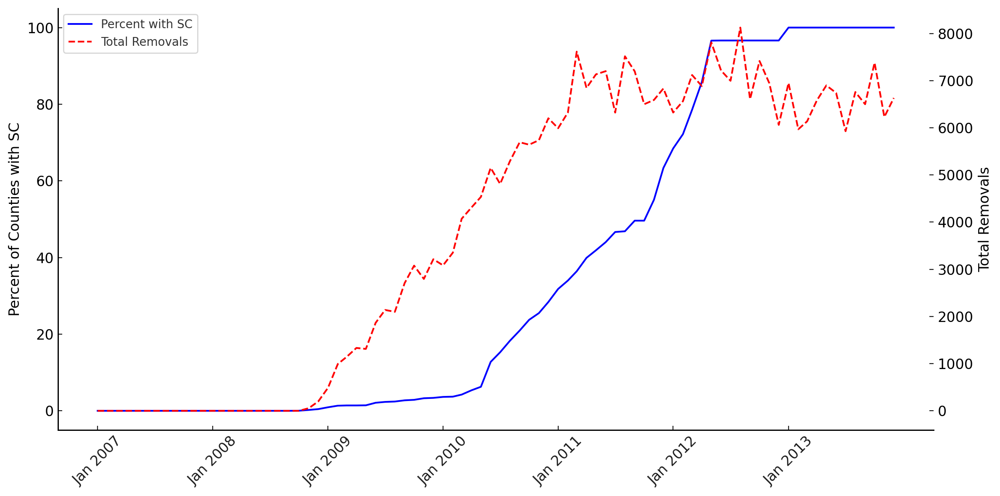
]

.footnotesize[Share of counties with SC (left axis) and monthly removals (right axis), 2008--2013.] .tiny[[[SC facts]](#app-sc-facts)]

---
name: objective-measures

## Objective Hispanic Identity Generations

<div style="width: 90%; margin: 0 auto; text-align: center;">

<div class="mermaid mermaid-compact">
graph LR
  %% Node Definitions
  Start("Are the child and both parents <br/> born in a Latin-American country?")

  Gen1("<b>1st Generation</b><br/>Foreign-born child<br/><small>Self-reported Hispanic: ~97%</small>")
  style Gen1 fill:#ff6600,stroke:#333,stroke-width:2px,color:#fff

  Q2("Does the US-born child have <br/> at least one parent born in a <br/> Latin-American country?")

  Gen2("<b>2nd Generation</b><br/>U.S.-born child, <br/>foreign-born parent(s)<br/><small>Self-reported Hispanic: ~94%</small>")
  style Gen2 fill:#2e8b57,stroke:#333,stroke-width:2px,color:#fff

  Q3("Is at least one grandparent born <br/> in a Latin-American country?")

  Gen3("<b>3rd Generation</b><br/>U.S.-born child & parents, <br/>foreign-born grandparent(s)<br/><small>Self-reported Hispanic: ~83%</small>")
  style Gen3 fill:#4b0082,stroke:#333,stroke-width:2px,color:#fff

  %% Flow Logic
  Start -- "Yes" --> Gen1
  Start -- "No" --> Q2

  Q2 -- "Yes" --> Gen2
  Q2 -- "No" --> Q3

  Q3 -- "Yes" --> Gen3
</div>

</div>


.center[
.tiny[[[Latin-American countries used]](#app-countries) [[Example 1]](#who-are-generations-ex1) [[Example 2]](#who-are-generations-ex2)]
]

---
## Empirical Strategy

- Event study model with unrestricted treatment effect heterogeneity .font50[.gray[**(Borusyak, Jaravel, and Spiess (2024))**]]:

$$
\begin{equation}
Y_{icst} = \lambda_c + \gamma_t + X_{icst}^{\prime} \delta + D_{icst}\tau_{icst} + \varepsilon_{icst} \nonumber
\end{equation}
$$

- Imputation procedure (3 steps):
  1. Estimate $\hat{\lambda}_c, \hat{\gamma}_t, \hat{\delta}$ using untreated observations only
  2. Impute counterfactual: $\hat{Y}_{icst}(0)$; compute $\hat{\tau}_{icst} = Y_{icst} - \hat{Y}_{icst}(0)$
  3. Aggregate into horizon-specific ATTs: $\hat{\tau}_h$

---
## Main results: SC reduces Hispanic identity

.pull-left[
.center[
**All Generations**

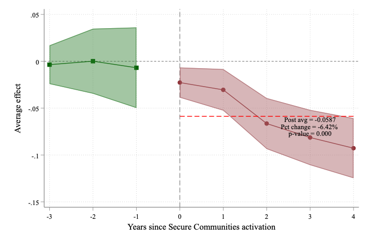
Overall ATT: .red[&minus;5.9 pp (6.4&#37;)]
]
]

.pull-right[
.center[
**First Generation**

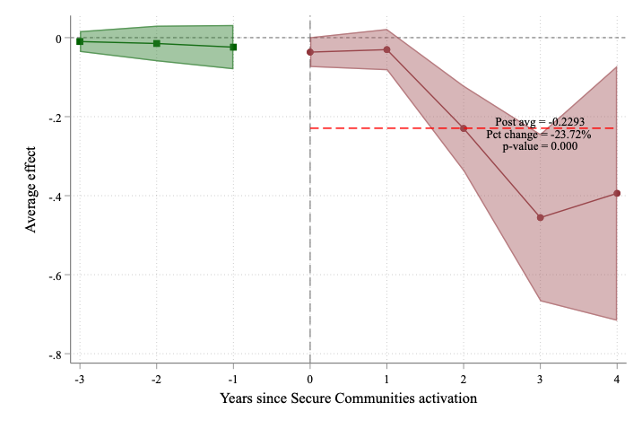

First gen: .red[&minus;22.9 pp (23.7&#37;)]
]
]


---
## Heterogeneity by generation

.pull-left[
.center[
**Second Generation**

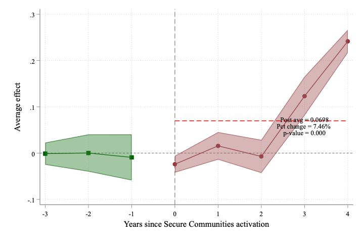
Second gen: .blue[+6.9 pp] (solidarity response)
]
]

.pull-right[
.center[
**Third Generation**

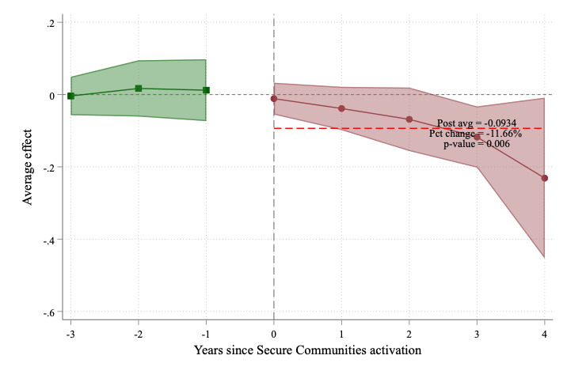
Third gen: .red[&minus;9.3 pp] (attrition)

]
]

---
## Heterogeneity by parental education

.pull-left[
.center[
**All Generations**

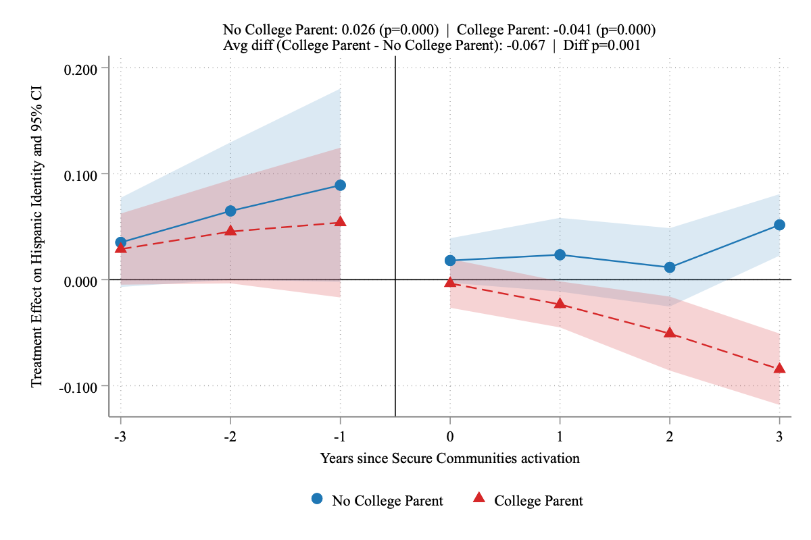
]
]

.pull-right[
.center[
**First Generation**

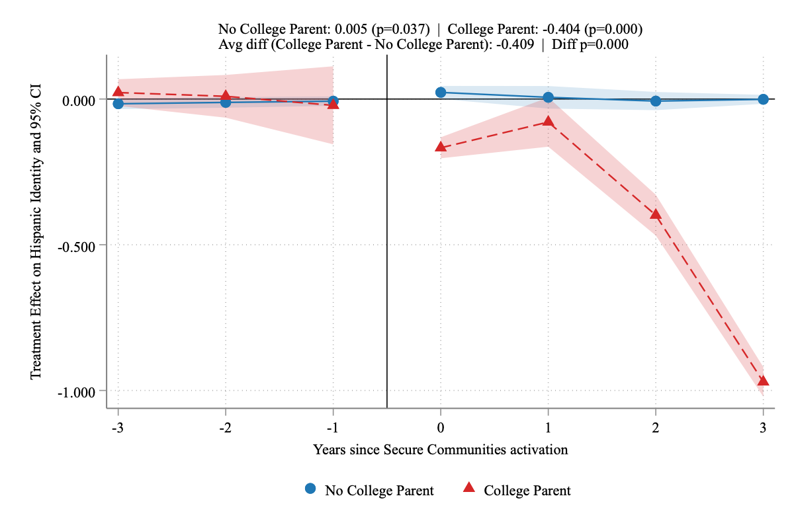
]
]

---
## Heterogeneity by parental education (continued)

.pull-left[
.center[
**Second Generation**

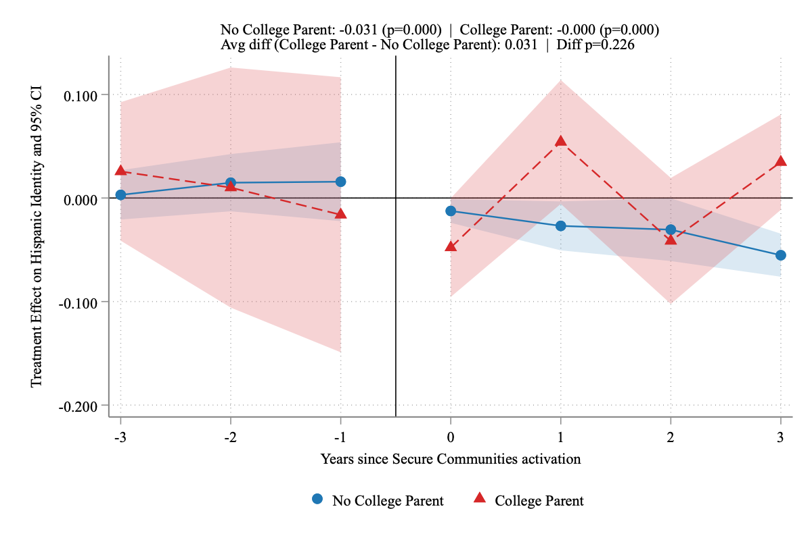
]
]

.pull-right[
.center[
**Third Generation**

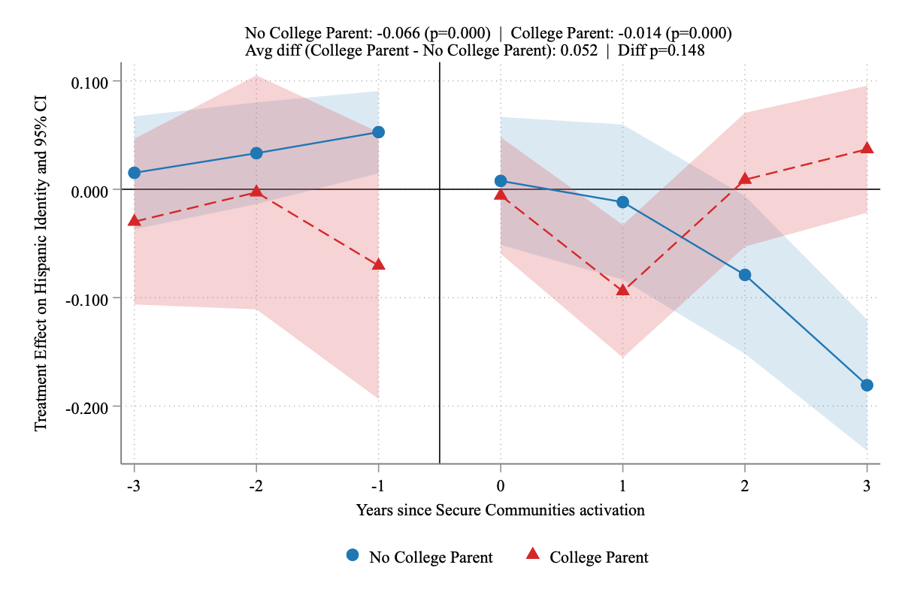
]
]

---
## Placebo and robustness

<div style="display: flex; gap: 18px; align-items: flex-start;">
  <div style="flex: 1; text-align: center;">
    <div><strong>Placebo</strong></div>
    <div class="font80">Fourth-generation Black children</div>
    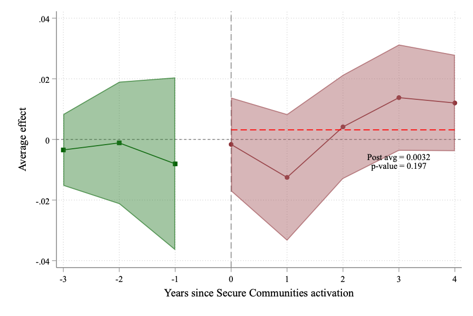
  </div>
  <div style="flex: 1; text-align: center;">
    <div><strong>Robustness</strong></div>
    <div class="font80">All Generations</div>
    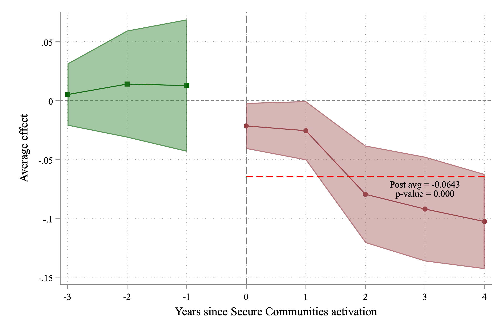
  </div>
  <div style="flex: 1; text-align: center;">
    <div><strong>Robustness</strong></div>
    <div class="font80">First Generation</div>
    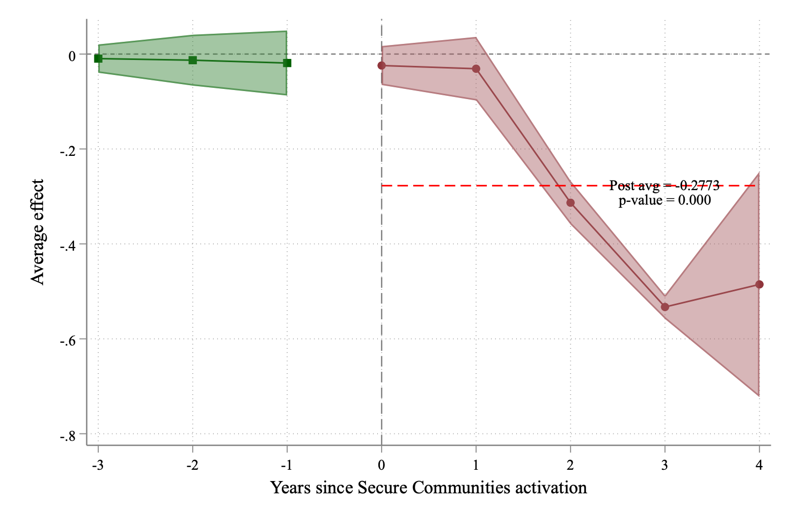
  </div>
</div>

.footnotesize[Robustness estimates exclude southern border counties and NY, MA, and IL. Results remain unchanged.]

---
name: conclusion-slide

## Conclusion

- #### Immigration enforcement causally changes Hispanic ethnic self-identification

  - ##### .brand-blue[Increased] Hispanic attrition among first and third generation Hispanic children

  - ##### .brand-azalea[Reduced] Hispanic attrition among second generation Hispanic children .tiny[[[Mechanisms]](#app-mechanisms)]

--

### Implications

- #### Political representation of Hispanics may be affected

- #### Self-reported Hispanic identity in evaluations of immigration enforcement may systematically bias causal inference
  - ##### .brand-blue[Overestimating] disparities between Hispanics and non-Hispanic whites
  - ##### .brand-azalea[Underestimating] intergenerational progress and assimilation of Hispanic immigrants

---
class: tulane-blue
background-image: url(assets/TulaneLogo-white.svg)
background-size: 260px
background-position: 5% 95%
count:false

# Thank you!

.pull-right[.pull-down[

<a href="mailto:hhadah@tulane.edu">
.white[`r icons::fontawesome("paper-plane")` hhadah@tulane.edu]
</a>

<a href="https://hussainhadah.com/">
.white[`r icons::fontawesome("link")` https://hussainhadah.com/]
</a>

<a href="https://github.com/hhadah">
.white[`r icons::fontawesome("github")` @hhadah]
</a>

<br><br><br>

]]

---
class: segue-yellow
background-image: url("assets/TulaneLogo.svg")
background-size: 20%
background-position: 95% 95%
count:false

# Appendix

---
name: app-objective-vs-subjective
count: false
## Objective vs. subjective Hispanic identity 

- ## .brand-crawfest[**Subjective**] measure: self-reported Hispanic identity (e.g., CPS Hispanic origin question)
  - Subject to measurement error and endogenous reporting bias .font50[.gray[**(Duncan and Trejo
2007, 2011, 2017; Antman, Duncan, and Trejo 2020b)**]]

- ## .brand-crawfest[**Objective**] measure: bases on the birthplace of the individual, their parents, and grandparents
 - More objective following the works of Antman et al. (2016) and Duncan and Trejo (2007, 2011, 2017) .tiny[[[Back]](#endogenous-attrition-plot)]

---
name: app-sc-background
count:false

## Background: Secure Communities

- Deportation program relying on partnerships between federal and local law enforcement agencies to identify and remove criminal aliens from the US
- Secure Communities has a checked history
  - 2008: Started as pilot program under the George W. Bush
  - Program authorized and expanded under Barack Obama, reaching all U.S. counties by end of 2013
  - 2014: Replaced by a "Priority Enforcement Program"
  - 2017: Reactivated in original form by Donald Trump
  - 2021: Joe Biden discontinued Secure Communities
  - 2025: Donald Trump reinstated Secure Communities

.tiny[.small[[[Back]](#motivation)]]

---
name: app-sc-work
count:false

## How Secure Communities works

- Prior to SC: identifying deportable non-citizens relied on manual interviews (e.g., 287(g) agreements)
- SC automated this process:
  1. Local police arrest individual $\rightarrow$ submit fingerprints to FBI
  2. Fingerprints *automatically* forwarded to DHS biometric database
  3. If match found $\rightarrow$ ICE reviews immigration status
  4. If violation identified $\rightarrow$ ICE issues detainer (hold up to 48 hours)

.tiny[.small[[[Back]](#motivation)]]

---
name: app-sc-facts
count:false

## Key facts about Secure Communities

- Rollout timing correlated with proximity to Mexican border and local Hispanic population size .font50[.gray[**(Miles and Cox 2014)**]]
- Between inception and 2014:
  - 46 million fingerprint submissions
  - 2.3 million removable alien identifications
  - ~440,000 deportations
  - More than 90&#37; of the deportees were Hispanic men (Mexico and other Central and South American countries)

.tiny[.small[[[Back]](#sc-rollout)]]

---
name: app-countries
count: false

## Latin-American countries used in this analysis .tiny[[[Back]](#objective-measures)]

<iframe src="assets/latin-america-countries-map.html" width="100%" height="500px" scrolling="no" style="border: none; border-radius: 8px;"></iframe>


---
name: who-are-generations-ex1
count: false

## Who are these generations?

.pull-left[
.center[


**Andy Garcia (Actor)**

.font70[
**Andy**: born in Cuba (naturalized US citizen)<br>
**Mother**: Amelie Menendez (Born in Cuba)<br>
**Father**: Rene Garcia Nunez (Born in Cuba)
]

.bold[.orange[1st Generation]]
]
]

.pull-right[
.center[


**George Prescott Bush (Commissioner, Texas General Land Office: 2015-2023)**

.font70[
**George**: born in Houston, Texas<br>
**Mother**: Columba Bush (Born in Mexico)<br>
**Father**: Jeb Bush (born in Midland, Texas)
]

.bold[.brand-crawfest[2nd Generation]]
]
]

.tiny[[[Back]](#objective-measures)]

---
name: who-are-generations-ex2
count: false

## Who are these generations?

.center[


**Ted Williams**

.font70[
**Ted**: born in San Diego, California<br>
**Mother**: May Venzor (born in Texas)<br>
**Father**: Samuel Williams (born in New York)<br>
**Both maternal grandparents**: born in Mexico
]

.bold[.brand-green[3rd Generation]]
]

.tiny[[[Back]](#objective-measures)]

---
name: app-summary
count:false

## Summary statistics

.font70[

|  | **All** | **1st Gen** | **2nd Gen** | **3rd Gen** |
|:--|:--:|:--:|:--:|:--:|
|  | (N=465,480) | (N=55,239) | (N=317,032) | (N=93,209) |
| Hispanic identity | 0.920 | 0.969 | 0.940 | 0.825 |
| Female | 0.485 | 0.486 | 0.484 | 0.485 |
| Age | 8.5 | 11.6 | 8.1 | 7.7 |
| Hispanic mother | 0.897 | 0.958 | 0.926 | 0.766 |
| Hispanic father | 0.884 | 0.944 | 0.916 | 0.749 |
| Frac. Hispanic in county | 0.332 | 0.303 | 0.339 | 0.328 |

]

.footnotesize[Note: CPS 2003--2013. White children ages &le; 17] 

.tiny[.pull-right[.small[[[Back]](#data-sample)]]]

---
name: app-mechanisms
count:false

## But how would SC impact self-reporting of Hispanic identity?

- SC may increase the salience and expected costs of being treated as Hispanic
- Two competing channels:
  1. .brand-crawfest[**Attrition channel**]: increased expected penalty $\Rightarrow$ individuals distance from Hispanic identity to reduce perceived exposure
  2. .brand-crawfest[**Reactive identity channel**]: heightened threat $\Rightarrow$ increased value of in-group attachment and solidarity

- Net effect is .brand-crawfest[**theoretically ambiguous**] and likely .brand-crawfest[**heterogeneous**]
  - Depends on switching costs, perceived exposure, generational ties
  
[[Back]](#conclusion-slide)

---
name: data-sample
count:false

## Data and sample

- Current Population Survey (CPS), 2003 to 2013
  - Self-reported Hispanic origin, race, ancestry, parental birthplace .tiny[[[Summary statistics](#app-summary)]]

- **Sample**: Children under 18 living with parents
  - Focus on White families: lower switching costs, more feasible to "pass"
  - Focus on children lets us define objective Hispanic indicators beyond 2nd gen

- **Outcome**: Self-reported Hispanic identity across ancestry-based Hispanic identity generations

[[Back]](#objective-measures)

```{r gen_pdf, include = FALSE, cache = FALSE, eval = TRUE}
library(renderthis)
# https://hhadah.github.io/nber-presentation/hadah-nber-presentation.html

to_pdf(from = "~/Projects/GiT/nber-presentation/hadah-nber-presentation.html", 
       to = "~/Projects/GiT/nber-presentation/hadah-nber-presentation.pdf")
to_pdf(from = "~/Projects/GiT/nber-presentation/hadah-nber-presentation.html")
```
